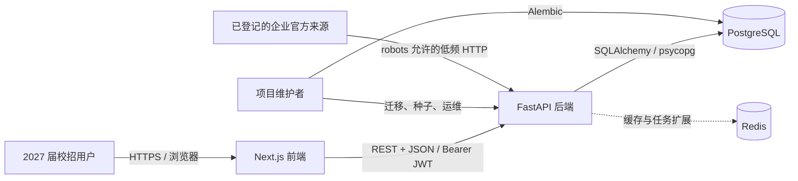
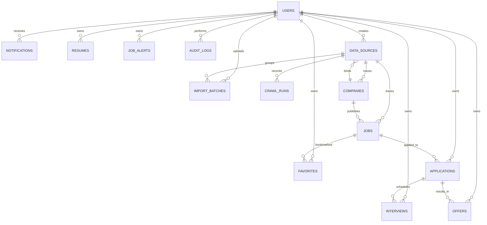
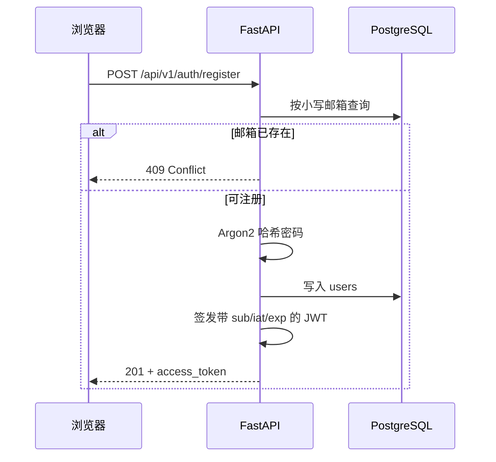

# OfferPilot AI 系统架构

## 1. 架构目标

项目采用本地优先的前后端分离模块化单体架构，在保持单机部署简单的同时，为数据核验、提醒任务、缓存和 AI 辅助保留清晰边界。

设计原则：

- **可信优先**：演示数据、待核验数据和未来已核验数据必须可区分。
- **用户隔离**：个人投递相关资源始终以认证用户为访问边界。
- **API 优先**：业务能力通过版本化 REST API 和 OpenAPI 描述。
- **渐进扩展**：第一阶段不引入不必要的微服务，但避免把数据层与页面逻辑耦合。
- **配置外置**：数据库连接、Redis、JWT 密钥、CORS 和 API 地址通过环境变量配置。
- **可重复运行**：迁移和种子脚本支持容器从空数据卷启动。

## 2. 系统上下文



Redis 在 Compose 中作为基础服务运行并带健康检查；第一阶段核心请求不依赖 Redis 才能正确工作。缓存、限流、任务队列和提醒调度属于后续扩展。

## 3. 容器与端口

| 服务 | 实现 | 容器端口 | 宿主机端口 | 依赖 |
| --- | --- | --- | --- | --- |
| `frontend` | Next.js standalone server | 3000 | 3000 | 健康的 backend |
| `backend` | Uvicorn + FastAPI | 8000 | 8000 | 健康的 postgres、redis |
| `postgres` | PostgreSQL 17 Alpine | 5432 | 5432 | 无 |
| `redis` | Redis 7 Alpine，AOF 开启 | 6379 | 6379 | 无 |

启动顺序由 Compose 健康检查协调。backend 启动命令先升级数据库到 Alembic head，再执行幂等种子脚本，最后启动 Uvicorn；frontend 等待 backend 健康后启动。

## 4. 代码结构与职责

### 4.1 前端

```text
frontend/src/
├── app/               # 路由、页面、根布局和受控应用布局
├── components/        # Shell、表格、图表、表单与状态组件
├── data/              # 明确标记的前端 Demo 展示数据
├── lib/api.ts         # 统一 API 地址、JWT Header、错误转换
└── stores/ui.ts       # 深色模式和移动导航状态
```

- **App Router** 管理页面路由和布局。
- **React Client Components** 承担交互表单、筛选、图表和导航状态。
- **TanStack Query** 提供请求缓存、失败重试和远程数据状态基础。
- **Zustand** 管理少量跨组件 UI 状态，并持久化深色模式偏好。
- **Recharts** 绘制趋势和分布图。
- **Tailwind CSS** 提供响应式样式和主题样式。
- `apiFetch` 统一读取 `NEXT_PUBLIC_API_URL`，在浏览器请求中附加 Bearer Token，并把非 2xx 响应转换为可显示错误。

第二阶段核心业务视图已经由 TanStack Query 驱动 API 数据；未登录的企业与岗位页保留明确标记的静态 Demo 降级展示。写操作完成后按资源 query key 失效缓存，并保留加载、空数据、错误和登录要求状态。

### 4.2 后端

```text
backend/app/
├── api/
│   ├── deps.py         # 数据库 Session 与当前用户依赖
│   └── v1/             # 版本化路由聚合与资源路由
├── core/
│   ├── config.py       # Pydantic Settings
│   └── security.py     # 密码哈希与 JWT
├── db/
│   ├── session.py      # Engine、SessionLocal、Base
│   └── seed.py         # 30/60 Demo 种子
├── models/             # SQLAlchemy 2 ORM 模型
├── schemas/            # 请求与响应 Pydantic 模型
└── main.py              # FastAPI 应用、中间件、健康检查
```

后端是同步 FastAPI 应用：

1. 路由通过依赖注入获得 SQLAlchemy Session；
2. 需要认证的路由解析 OAuth2 Bearer Token；
3. Pydantic 在业务函数运行前验证输入；
4. SQLAlchemy ORM 执行查询和事务；
5. response model 过滤并序列化输出；
6. FastAPI 自动生成 `/openapi.json`、`/docs` 和 `/redoc`。

当前路由按资源分为 `auth`、`companies`、`jobs`、`favorites`、`applications`、`interviews`、`offers`、`notifications`、`resumes`、`job_alerts`、`activity` 和 `dashboard`。第二阶段新增 service 层承载附件存储、提醒生成和审计写入；更复杂的查询可继续下沉到 repository 层。

第四阶段在 FastAPI lifespan 中启动单进程本地调度循环。循环只查询到期且启用的数据源，通过独立数据库 Session 运行同步；解析器位于 `services/official_crawler.py`。URL 在请求及重定向时进行公网校验，robots.txt、超时、响应大小和每批条数均为硬限制。该设计适合 Compose 中的单个 Uvicorn 实例；扩展为多实例前必须迁移到带分布式锁的任务队列。

### 4.3 数据层

PostgreSQL 是系统事实来源，保存用户、企业、岗位和个人求职记录。SQLAlchemy 2 使用声明式类型映射，Alembic 管理 schema 版本。

核心关系：



详细字段、约束和迁移说明见 [DATABASE.md](DATABASE.md)。

## 5. 请求与认证流程

### 5.1 注册



### 5.2 认证请求

1. 浏览器发送 `Authorization: Bearer <token>`。
2. 后端使用配置的 `SECRET_KEY` 和 HS256 验证签名与过期时间。
3. 从 JWT `sub` 读取用户 ID。
4. 查询用户并确认存在且 `is_active = true`。
5. 路由只查询或修改该用户范围内的个人资源。

无效、过期、用户不存在或停用均返回 401，不向客户端暴露验证细节。

### 5.3 安全演进说明

第一阶段浏览器客户端将访问令牌存入 `localStorage`，实现简单但令牌可被同源脚本读取。生产化前应评估改用 Secure、HttpOnly、SameSite Cookie，并同时引入 CSRF 防护、刷新 Token 轮换、撤销机制、CSP 和依赖审计。

## 6. 数据查询与聚合

### 6.1 资源列表

- 企业、岗位及所有用户记录列表使用 `page` 和 `page_size` 做 offset/limit 分页；
- 搜索使用 PostgreSQL 兼容的大小写不敏感匹配；
- 筛选条件在数据库层组合；
- 排序字段使用明确白名单，不能把任意字段名注入查询；
- 响应统一包含 `items`、`total`、`page`、`page_size`、`pages`。

### 6.2 Dashboard

Dashboard 在单次请求中计算：

- 非 Demo 且状态为 `open` 的企业数及学历可投数量；
- 非 Demo 且状态为 `open` 的当日新增岗位；
- 当前用户投递、面试和 Offer 数量；
- 非 Demo 且状态为 `open` 的未来 14 天截止岗位；
- 最近 7 天当前用户投递趋势；
- 企业行业 Top 10 分布；
- 最近 5 条当前用户投递，并返回岗位名和企业名。

当前实现使用实时 SQL 聚合，适合 MVP 数据规模。数据量增长后可基于查询分析结果增加组合索引、Redis 短期缓存、物化视图或异步预聚合。缓存键必须包含用户 ID 和筛选上下文，避免跨用户数据泄露。

## 7. 配置体系

后端使用 Pydantic Settings，配置来源优先级为进程环境变量与 `.env`。核心变量：

- `DATABASE_URL`
- `REDIS_URL`
- `SECRET_KEY`
- `CORS_ORIGINS`
- `ACCESS_TOKEN_EXPIRE_MINUTES`（采用默认值时为 1440 分钟）
- `API_V1_PREFIX`（采用默认值时为 `/api/v1`）
- `UPLOAD_DIR`（本地附件目录）
- `MAX_UPLOAD_BYTES`（附件大小上限）
- `MAX_IMPORT_BYTES`（本地 CSV 大小上限）
- `ADMIN_EMAILS`（本地管理员首次注册白名单）

前端构建期公开变量为 `NEXT_PUBLIC_API_URL`。带 `NEXT_PUBLIC_` 前缀的变量会进入浏览器代码，不得包含密钥。

Docker Compose 通过服务名 `postgres` 和 `redis` 进行容器网络解析；宿主机本地开发则使用 `localhost`。

## 8. 错误处理

| 类型 | HTTP 状态 | 示例 |
| --- | --- | --- |
| 输入校验失败 | 422 | 邮箱格式错误、页大小超限 |
| 未认证或令牌无效 | 401 | 缺少 Bearer Token、JWT 过期 |
| 资源不存在 | 404 | 企业、岗位或用户记录不存在 |
| 状态冲突 | 409 | 邮箱重复注册 |
| 未处理异常 | 500 | 统一返回通用错误，不泄露内部细节 |

前端应把错误放在发生请求的上下文中展示，保留重试入口。网络失败不能被渲染成空数据；空数据也不应显示成系统错误。

## 9. 健康检查与可观测性

当前健康检查：

- PostgreSQL：`pg_isready`；
- Redis：`redis-cli ping`；
- Backend：请求 `GET /health`；
- Frontend：依赖 backend 健康后启动。

`/health` 当前验证 API 进程可响应，不代表数据库和 Redis 的深度读写检查。生产环境建议拆分：

- liveness：仅检查进程事件循环；
- readiness：检查关键依赖可用性；
- startup：检查迁移状态和应用初始化。

后续可增加结构化 JSON 日志、请求 ID、延迟和错误率指标、数据库连接池指标以及 OpenTelemetry Trace。日志不得记录密码、JWT、简历内容或完整个人敏感信息。

## 10. CI 与交付

GitHub Actions 在 `dev`、`main` push 和 Pull Request 上运行：

- 前端：`npm ci`、ESLint、TypeScript 和生产构建；
- 后端：安装开发依赖、Ruff lint/format、mypy、SQLite API 测试和 PostgreSQL 集成测试；
- E2E：构建完整 Compose 环境并运行 Playwright Chromium 关键路径；
- 测试环境使用独立数据库配置，不读取开发密钥。

Prettier 和 `ruff format --check` 是提交前的本地检查；若团队希望将格式作为服务端强制门禁，可在 CI 中加入对应命令。

容器镜像采用多阶段前端构建；Next.js 以 standalone 输出运行。后端镜像安装项目依赖并执行迁移、种子和 Uvicorn。生产环境应将“迁移”改为单独、可审计且只能执行一次的部署步骤，避免多个副本并发迁移。

## 11. 数据安全边界

- `users.hashed_password` 永不通过 Schema 返回；
- JWT 签名密钥只从环境变量获得；
- 个人资源通过当前用户依赖和 `user_id` 查询条件隔离；
- Demo 企业与岗位不携带真实投递链接；
- 数据来源和最后核验时间是核心元数据，不得在导入时丢弃；
- 审计日志只保存必要变更摘要，不复制敏感正文；
- 数据库和 Redis 端口在 Compose 中为本地开发开放，生产部署不应直接暴露公网。

## 12. 扩展路径

### 12.1 业务层演进

当路由复杂度增长时引入：

```text
route -> service -> repository -> SQLAlchemy
```

- route：HTTP 协议和依赖注入；
- service：权限、状态机、事务和业务规则；
- repository：可复用查询；
- worker：导入、提醒、核验等异步任务。

### 12.2 Redis 用途

- Dashboard 短期缓存；
- API 限流计数；
- 通知/提醒任务队列；
- 数据导入去重锁；
- 登录会话撤销列表。

Redis 只能作为可重建的派生状态或协调设施，PostgreSQL 仍是业务事实来源。

### 12.3 AI 能力边界

未来 AI 服务应作为独立适配层接入，并满足：

- 用户明确选择和授权；
- 输入最小化、敏感字段脱敏；
- 输出标注为模型生成并允许编辑；
- 不把模型推断写成招聘事实；
- 记录模型版本、提示模板版本和来源摘要；
- 在外部模型不可用时不影响核心求职记录功能。

## 13. 架构决策记录

| 决策 | 理由 | 后续评估点 |
| --- | --- | --- |
| 模块化单体而非微服务 | MVP 易启动、易调试、事务简单 | 团队与负载增长后按明确边界拆分 |
| PostgreSQL 为事实来源 | 关系数据、约束和查询能力适合求职流程 | 搜索量增长后评估全文检索服务 |
| JWT Bearer | 前后端分离接入简单 | 生产化前评估 Cookie 与刷新机制 |
| 同步 SQLAlchemy Session | 实现直接，适合当前规模 | 高并发或长 I/O 增长时评估异步栈 |
| Redis 先部署后按需使用 | 提前验证基础环境，不让核心路径依赖缓存 | 引入用途时补充失效与降级策略 |
| 演示数据显式标记 | 防止招聘信息误导 | 真实来源接入后增加核验状态机 |
