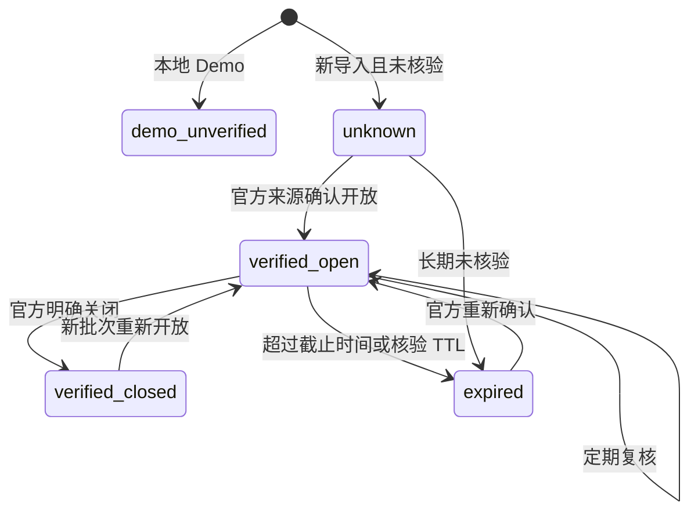

# OfferPilot AI 数据来源与合规策略

## 1. 目的

招聘信息直接影响用户的时间安排和求职决策。错误的开放状态、截止时间、学历要求或投递链接可能使用户错过机会，甚至暴露个人信息。因此，OfferPilot AI 将来源透明、状态核验和不过度采集视为产品核心要求，而不是附加说明。

本文件规定 Demo 数据、本地导入和第四阶段官方来源自动同步必须满足的授权、核验、展示、更新和下线要求。

系统支持管理员主动上传 UTF-8 CSV，也支持管理员逐个登记明确允许自动访问的企业官方招聘页或官方 Feed。同步器只解析 HTML 链接、RSS、Atom 和 JSON Feed，不执行 JavaScript、不登录、不绕过验证；运行会记录来源、时间、数量和失败原因。企业按规范化名称、岗位按官方 URL或“企业 + 岗位名称”去重，新增或关键链接更新记录都必须重新人工核验。

自动同步采用本地后台循环，检查 robots.txt，拒绝内网/本机/保留地址，限制请求超时、响应大小、单批数量和最低同步间隔。robots 无法确认、页面需要登录或存在访问限制时应停止，而不是尝试规避。

## 2. 内置数据声明

仓库包含两类目的不同的数据：30 家/60 个开发 Demo，以及 2026-07-16 人工核验的 14 家企业、23 个正式招聘项目或岗位。正式基线的溯源清单位于 `database/official-recruitment-2026-07-16.csv`，并由 `python -m app.db.seed_official` 幂等写入。

Demo 数据用于开发、测试和 UI 演示：

- 30 家示例企业；
- 60 个示例岗位；
- 覆盖互联网、人工智能、通信、半导体、新能源、制造业、银行、央企国企、医药和物流；
- 企业名称、岗位描述、日期和统计值均为演示内容；
- 不代表真实企业存在，不代表任何企业正在招聘；
- 不提供声称有效的真实投递链接；
- 不应用于投递、商业分析、企业评价或录用概率判断。

数据库种子必须保留以下标识：

| 字段 | Demo 值 | 含义 |
| --- | --- | --- |
| `is_demo` | `true` | 明确为演示数据 |
| `recruitment_status` | `demo_unverified` | 未核验，不是开放状态 |
| `data_source` | `demo_seed_not_realtime` | 来源为非实时本地种子 |
| `last_verified_at` | `null` | 从未做真实来源核验 |
| `application_url` | `null` | 不提供伪造投递入口 |

名称或描述还应包含 `Demo` / “示例”提示。前端不得隐藏这些字段后把记录渲染成“实时开放”。

正式基线仅表示在核验日看到的官方招聘入口或岗位，不代表全网覆盖或永久开放。访客页面默认请求 `verified_within_days=30`；超过 30 天没有再核验的记录自动退出默认列表。已结束或官网显示零岗位的项目不进入基线，用户投递前仍需在官网复核。

## 3. 数据分类

### 3.1 Demo 数据

为产品开发构造，不对应可信外部事实。可用于：

- UI 布局与响应式验证；
- 搜索、筛选、排序和分页测试；
- Dashboard 聚合与图表演示；
- API、迁移和容器初始化测试。

不可用于：

- 对外宣传招聘覆盖率；
- 向用户发送真实截止提醒；
- 生成企业或岗位推荐结论；
- 与真实企业建立隐含关联；
- 训练或评估声称反映真实招聘市场的模型。

### 3.2 用户主动录入数据

包括个人收藏、投递、面试、Offer、备注、简历和偏好。处理原则：

- 只用于用户请求的求职管理功能；
- 默认不公开、不跨用户聚合敏感内容；
- 最小化收集，不要求与功能无关的信息；
- 提供修改、导出和删除能力的产品路线；
- 薪酬、简历、联系方式和备注按敏感数据保护；
- 不把个人数据加入种子、日志、错误追踪或 Git。

### 3.3 经授权或人工核验的外部数据

只有满足授权、明确许可或人工根据官方页面核验并保留最小摘要的数据才能进入正式管线，例如：

- 企业或合作方通过正式接口提供；
- 公开数据集明确许可当前用途；
- 企业官方提供可复用的 RSS/API/导出；
- 由管理员根据官方公开页面人工录入并保留来源；
- 用户为自己的使用提供链接或内容，并确认其有权处理。

“公开可访问”不自动等于“允许批量复制、再发布或商业使用”。接入前必须审查网站条款、robots 指示、版权、数据库权利、个人信息和适用法律。

## 4. 明确禁止的能力

项目不得实现或指导以下行为：

- 绕过验证码、滑块、人机验证或短信验证；
- 规避反爬、频率限制、访问控制、付费墙或登录限制；
- 盗用、共享或自动提取他人的登录 Cookie、Token 或账号；
- 伪装浏览器指纹、轮换代理以绕过封禁；
- 在网站明确禁止时继续自动抓取；
- 未经授权自动投递、批量提交简历或代替用户确认协议；
- 收集与求职管理无关的个人信息；
- 复制和再发布受版权保护的完整职位描述而没有合法依据；
- 用 AI 猜测企业开放状态、截止日期或学历门槛并当作事实展示。

如果来源需要上述手段才能获取，则该来源不符合 OfferPilot AI 的接入条件。

## 5. 来源准入清单

接入新的真实来源前，负责人必须记录并审批：

| 项目 | 必填说明 |
| --- | --- |
| 来源名称 | 企业、平台或数据集名称 |
| 来源类型 | 官方 API、合作方 Feed、公开数据集、人工录入等 |
| 来源 URL | 可追溯到具体页面或 API 文档 |
| 权利基础 | 合同、许可、条款允许、用户授权等 |
| 允许用途 | 展示、搜索、统计、提醒、内部处理等 |
| 禁止用途 | 再分发、缓存、模型训练等限制 |
| 获取方式 | API、Feed、文件导入或人工录入 |
| 更新频率 | 与许可及业务新鲜度一致 |
| 保存期限 | 原始数据与派生数据分别说明 |
| 删除机制 | 来源撤回、更正、过期后的处理 |
| 责任人 | 数据 Owner 与技术 Owner |
| 审查日期 | 最近法律/合规/安全审查时间 |

缺少权利基础、责任人或删除机制的来源不得进入生产数据库。

## 6. 采集原则

即使来源已获授权，也应遵循：

1. **最小化**：只采集企业、岗位、学历、城市、时间、来源等必要字段。
2. **低影响**：优先官方 API、增量接口、ETag 和条件请求，不高频重复下载。
3. **可识别**：按来源要求使用清晰客户端标识和联系方式。
4. **可停止**：支持按来源立即暂停导入。
5. **可重放**：导入批次可审计，失败后可安全重试。
6. **幂等**：使用来源 ID、规范化 URL 或内容指纹去重。
7. **不绕过**：出现验证、封禁或条款限制时停止并升级人工审查。
8. **敏感数据排除**：不采集招聘联系人私人电话、个人邮箱或候选人信息，除非有明确合法目的与保护措施。

## 7. 建议的来源元数据

当前模型已有 `data_source` 和 `last_verified_at`。真实数据管线至少还应逐步增加：

| 字段 | 说明 |
| --- | --- |
| `source_name` | 可读来源名称 |
| `source_url` | 具体来源页面/API URL |
| `source_record_id` | 来源系统稳定 ID |
| `source_license` | 许可或合同标识 |
| `fetched_at` | 获取时间 |
| `first_seen_at` | 首次发现时间 |
| `last_seen_at` | 来源最后仍存在时间 |
| `last_verified_at` | 最近可信核验时间 |
| `verification_method` | API、人工、合作方签名 Feed 等 |
| `content_hash` | 去重与变更检测指纹 |
| `import_batch_id` | 导入批次 |
| `raw_expires_at` | 原始内容删除时间 |
| `is_demo` | Demo 与正式数据隔离 |

来源 URL 不应包含访问 Token、会话参数或用户个人标识。

## 8. 标准化与质量校验

### 8.1 标准化

- 企业名称：保留官方名称，同时保存标准化匹配键；
- 行业和企业性质：映射到受控词表，保留原始值；
- 城市：映射行政区或标准城市代码，支持多城市；
- 学历：拆分最低学历与原始文本，不用关键词误判“专科可投”；
- 日期：保留来源时区，转换为 UTC 存储日期时间；
- URL：只允许 `http` / `https`，移除跟踪参数并防止危险 scheme；
- 描述：保留合法范围内必要摘要，清理恶意 HTML；
- 状态：未知或未核验不能默认映射为开放。

### 8.2 自动校验

- 必填字段存在；
- 截止时间不早于开放/发布时间，异常进入人工队列；
- 企业外键存在；
- 来源和核验元数据完整；
- Demo 数据不含真实投递 URL；
- URL 域名符合来源白名单；
- 内容指纹重复项按规则合并；
- 超过允许长度或含脚本内容的字段被拒绝或安全清理。

自动校验不能替代来源核验。对学历、专业、城市、截止时间等高影响字段发生冲突时，应降级状态并提示用户查看官方渠道。

## 9. 核验状态机

建议使用以下语义：

规则：

- `demo_unverified` 永不自动升级为真实状态；
- `unknown` 不显示为开放；
- `verified_open` 必须有来源和 `last_verified_at`；
- 超过来源级 TTL 后自动降级为 `expired` 或 `unknown`；
- 截止时间为空时不能假设长期开放；
- 来源撤回或页面消失时先降级，不应仅凭 404 立即永久删除历史记录。

## 10. 核验频率

频率由来源许可和业务风险共同决定，不能为了“实时”违反条款。建议起点：

| 数据 | 建议复核 |
| --- | --- |
| 未来 7 天截止岗位 | 每日，前提是来源允许 |
| 8–30 天截止岗位 | 每 3 天 |
| 无截止时间岗位 | 每 7 天并显示未知截止 |
| 已关闭/过期记录 | 低频或按新批次触发 |
| 企业静态资料 | 每 30–90 天 |

若来源只允许更低频率，以许可为准，并在产品中展示相应新鲜度。

## 11. 冲突与更正

多个来源冲突时：

1. 企业官方校招页面/API优先于聚合平台；
2. 合作方签名 Feed 优先于未经核验的人工转载；
3. 较新时间不必然更可信，仍需考虑来源等级；
4. 不自动合并会改变学历、截止时间或投递链接的冲突；
5. 暂不能确认时标记待核验，并同时展示来源与时间；
6. 记录更正原因、操作者、旧值摘要和新值摘要；
7. 为企业或用户提供纠错与下线渠道。

## 12. 展示规范

每条正式招聘记录应让用户看见：

- 数据来源；
- 最后核验时间；
- 当前状态；
- 截止时间及其时区/未知提示；
- 跳转外部官方渠道的提示；
- “投递前请在企业官方渠道复核”的免责声明。

Demo 记录应在列表、详情、Dashboard、日历和通知中持续显示 Demo 状态，不能只在首次进入时提示一次。

产品文案禁止使用无法证明的“实时”“全网”“官方合作”“100% 准确”等表述。

## 13. 用户数据与隐私

### 13.1 最小化

- 注册只需要邮箱、姓名和密码；
- 投递、面试、Offer 备注由用户自愿填写；
- 简历功能上线前明确用途、类型、大小、保留期和删除方式；
- 不要求身份证号、银行卡、家庭成员等无关信息。

### 13.2 访问控制

- 个人记录只允许本人访问；
- 管理员能力必须有明确角色与审计；
- 运维数据库访问遵循最小权限；
- 测试和 Demo 环境不得复制生产个人数据；
- 导出文件使用短期链接并记录访问。

### 13.3 保留与删除

生产上线前必须定义：

- 账户注销后的删除流程；
- 备份中的延迟删除窗口；
- 审计与安全日志的最短必要保留期；
- 用户导出格式；
- 来源撤回与数据主体请求处理时限。

## 14. AI 使用边界

未来若接入 AI：

- 只在用户明确触发并知情的情况下发送必要内容；
- 默认不把完整简历、联系方式和 Offer 薪酬用于模型训练；
- 对第三方模型说明数据处理与保留方式；
- 输出必须标注为 AI 生成并允许用户修改；
- 不根据演示数据生成真实企业结论；
- 不生成或补全未知截止时间、开放状态和投递链接；
- 不自动代表用户提交申请或接受 Offer；
- 保存模型、提示版本和输入来源摘要以支持问题追踪。

## 15. 安全与事件响应

发现下列情况时应立即暂停相关来源或功能：

- 来源方提出停止或删除请求；
- 数据中出现候选人个人信息或访问密钥；
- 导入逻辑绕过访问控制或超过许可频率；
- 大量错误截止日期或错误投递链接；
- 用户数据跨账号泄露；
- Demo 标识丢失并被展示成真实状态。

响应步骤：隔离影响范围、停止导入/展示、保留最小必要证据、评估用户影响、修复与回滚、通知相关责任人、完成事后复盘。不要在公共 Issue 或日志中粘贴敏感数据。

## 16. 发布前数据检查

- [ ] 所有 Demo 企业和岗位 `is_demo = true`
- [ ] 所有 Demo 状态为 `demo_unverified`
- [ ] Demo 来源明确包含非实时语义
- [ ] Demo 投递链接为空
- [ ] 页面、API 文档和 README 均有 Demo 声明
- [ ] 新来源有权利基础、Owner、URL、更新频率和删除机制
- [ ] 没有验证码绕过、反爬规避或账号复用逻辑
- [ ] 未知状态不会显示为开放
- [ ] 过期策略和最后核验时间生效
- [ ] 用户敏感信息不在日志、种子、测试夹具或仓库中
- [ ] 更正、下线和事件响应联系人明确

## 17. 责任边界

OfferPilot AI 是求职流程管理工具。即使未来接入经核验来源，也无法保证第三方信息始终准确、岗位持续有效或企业一定回复。用户在提交简历、提供个人信息或接受 Offer 前，应访问企业官方渠道复核并自行判断。该原则必须贯穿数据模型、API、前端文案和运营流程。
