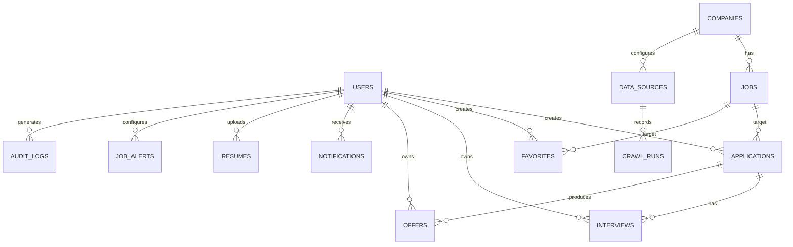

# OfferPilot AI 数据库设计

## 1. 概览

OfferPilot AI 使用 PostgreSQL 作为业务事实来源，SQLAlchemy 2 负责 ORM 映射，Alembic 负责 schema 版本管理。Redis 是缓存与任务扩展设施，不保存不可恢复的核心业务事实。

第四阶段包含 14 张表：原有 11 张业务表、`data_sources`、`import_batches`，以及官方来源同步运行表 `crawl_runs`。

```text
users
companies
jobs
applications
favorites
interviews
offers
notifications
resumes
job_alerts
audit_logs
data_sources
import_batches
crawl_runs
```

迁移版本依次为 `0001`、`0002`、`0003`、`0004`。多数业务表包含 `created_at` 和 `updated_at`，由数据库生成创建时间并在更新时维护修改时间。

## 2. 关系图



## 3. 通用约定

### 3.1 主键与外键

- 所有表使用整数 `id` 作为主键。
- 用户资源外键通过 `user_id` 关联 `users.id`。
- 企业与岗位为一对多：`jobs.company_id -> companies.id`。
- 投递与面试/Offer 为一对多基础关系：`application_id -> applications.id`。
- 关键外键建立索引，便于按用户和关联资源查询。

### 3.2 时间

- 事件时间优先使用带时区的 `DateTime(timezone=True)`；
- 只需要日历日期的字段使用 `Date`，例如 Offer 收到日期；
- 服务端统计使用 UTC；
- 客户端负责把时间转换为用户本地时区；
- 未核验、未知或不适用的时间使用 `NULL`，不能用伪造时间填充。

### 3.3 状态字段

第一阶段使用字符串状态，便于快速迭代。建议值：

| 领域 | 建议值 |
| --- | --- |
| 招聘数据 | `demo_unverified`、`verified_open`、`verified_closed`、`expired`、`unknown` |
| 投递 | `planned`、`applied`、`written_test`、`interview`、`offer`、`rejected`、`withdrawn`、`completed` |
| 面试 | `scheduled`、`completed`、`cancelled`、`rescheduled` |
| Offer | `pending`、`accepted`、`declined`、`expired`、`withdrawn` |

当前数据库未以 Enum 或 Check Constraint 限制这些值。生产化前应集中定义状态常量，并通过数据库约束或状态表避免拼写漂移。

### 3.4 Demo 元数据

企业和岗位使用以下字段避免演示数据被误解为真实招聘：

- `is_demo = true`
- `recruitment_status = demo_unverified`
- `data_source = demo_seed_not_realtime`
- `last_verified_at = NULL`

`last_verified_at = NULL` 不是“仍然有效”，而是“从未进行真实来源核验”。

## 4. 表设计

### 4.1 `users`

用户身份与账户状态。

| 字段 | 类型 | 可空 | 说明 |
| --- | --- | --- | --- |
| `id` | Integer | 否 | 主键 |
| `email` | String(255) | 否 | 唯一邮箱，带索引，按小写保存 |
| `full_name` | String(100) | 否 | 用户显示姓名 |
| `hashed_password` | String(255) | 否 | Argon2 密码哈希，不得出现在 API 响应或日志 |
| `is_active` | Boolean | 否 | 是否允许认证，默认 true |
| `is_admin` | Boolean | 否 | 管理标记，默认 false；第一阶段尚未提供完整 RBAC |
| `created_at` | Timestamptz | 否 | 创建时间 |
| `updated_at` | Timestamptz | 否 | 更新时间 |

约束与索引：`email` 唯一，且有查询索引。

### 4.2 `companies`

企业主数据。字段覆盖校招检索和数据溯源所需最小集合。

| 字段 | 类型 | 可空 | 说明 |
| --- | --- | --- | --- |
| `id` | Integer | 否 | 主键 |
| `name` | String(200) | 否 | 企业名称，带索引 |
| `industry` | String(100) | 否 | 行业，带索引 |
| `company_type` | String(100) | 否 | 企业性质 |
| `website` | String(500) | 是 | 企业官网 |
| `campus_website` | String(500) | 是 | 校招官网 |
| `logo_url` | String(500) | 是 | Logo URL |
| `recruitment_status` | String(50) | 否 | 招聘/核验状态，带索引 |
| `open_date` | Date | 是 | 开放日期 |
| `deadline` | Date | 是 | 截止日期，带索引 |
| `education_requirement` | String(100) | 否 | 学历要求摘要 |
| `accepts_college` | Boolean | 否 | 专科是否可投 |
| `accepts_bachelor` | Boolean | 否 | 本科是否可投 |
| `major_requirement` | Text | 是 | 专业要求 |
| `work_cities` | String(500) | 否 | 工作城市，第一阶段以文本保存 |
| `data_source` | String(200) | 否 | 数据来源标识 |
| `last_verified_at` | Timestamptz | 是 | 最后人工或可信流程核验时间 |
| `is_demo` | Boolean | 否 | 是否为演示数据，带索引 |
| `created_at` | Timestamptz | 否 | 创建时间 |
| `updated_at` | Timestamptz | 否 | 更新时间 |

删除企业会通过 `jobs.company_id` 的 `ON DELETE CASCADE` 删除关联岗位。生产环境中应优先考虑归档/软删除，并在删除前检查用户业务记录影响。

### 4.3 `jobs`

岗位主数据。

| 字段 | 类型 | 可空 | 说明 |
| --- | --- | --- | --- |
| `id` | Integer | 否 | 主键 |
| `title` | String(200) | 否 | 岗位名称，带索引 |
| `company_id` | Integer | 否 | 关联企业，带索引，删除企业时级联 |
| `category` | String(100) | 否 | 岗位类别，带索引 |
| `work_cities` | String(500) | 否 | 工作城市，带索引 |
| `education_requirement` | String(100) | 否 | 学历要求，带索引 |
| `major_requirement` | Text | 是 | 专业要求 |
| `description` | Text | 否 | 岗位描述 |
| `requirements` | Text | 否 | 任职要求 |
| `application_url` | String(500) | 是 | 投递链接；Demo 数据为空 |
| `published_at` | Timestamptz | 是 | 发布时间 |
| `deadline` | Timestamptz | 是 | 截止时间，带索引 |
| `recruitment_status` | String(50) | 否 | 招聘/核验状态，带索引 |
| `data_source` | String(200) | 否 | 来源标识 |
| `last_verified_at` | Timestamptz | 是 | 最后核验时间 |
| `is_demo` | Boolean | 否 | 是否为演示数据，带索引 |
| `created_at` | Timestamptz | 否 | 创建时间 |
| `updated_at` | Timestamptz | 否 | 更新时间 |

索引：除单列索引外，当前还建立 `(title, category, work_cities)` 复合索引 `ix_jobs_search`。生产数据规模增长后应基于 `EXPLAIN ANALYZE` 评估 trigram/全文索引，而不是盲目增加索引。

### 4.4 `favorites`

用户收藏岗位的关联表。

| 字段 | 类型 | 可空 | 说明 |
| --- | --- | --- | --- |
| `id` | Integer | 否 | 主键 |
| `user_id` | Integer | 否 | 用户外键，带索引，级联删除 |
| `job_id` | Integer | 否 | 岗位外键，带索引，级联删除 |
| `created_at` | Timestamptz | 否 | 收藏时间 |
| `updated_at` | Timestamptz | 否 | 更新时间 |

唯一约束：`UNIQUE(user_id, job_id)`，同一用户不能重复收藏同一岗位。

### 4.5 `applications`

用户投递流程的核心记录。

| 字段 | 类型 | 可空 | 说明 |
| --- | --- | --- | --- |
| `id` | Integer | 否 | 主键 |
| `user_id` | Integer | 否 | 用户外键，带索引，级联删除 |
| `job_id` | Integer | 否 | 岗位外键，带索引，级联删除 |
| `status` | String(50) | 否 | 投递阶段，默认 `planned`，带索引 |
| `applied_at` | Timestamptz | 是 | 实际投递时间 |
| `channel` | String(100) | 是 | 官网、内推、招聘平台等渠道 |
| `notes` | Text | 是 | 用户备注 |
| `created_at` | Timestamptz | 否 | 创建时间 |
| `updated_at` | Timestamptz | 否 | 更新时间 |

同一用户可按业务需要对同一岗位保留多条记录；若产品决定禁止重复投递，需要新增唯一约束或业务校验，不能仅依赖前端。

### 4.6 `interviews`

| 字段 | 类型 | 可空 | 说明 |
| --- | --- | --- | --- |
| `id` | Integer | 否 | 主键 |
| `user_id` | Integer | 否 | 用户外键，带索引，级联删除 |
| `application_id` | Integer | 否 | 投递外键，带索引，级联删除 |
| `interview_type` | String(100) | 否 | 技术面、HR 面、群面等 |
| `scheduled_at` | Timestamptz | 否 | 计划时间，带索引 |
| `status` | String(50) | 否 | 默认 `scheduled` |
| `location` | String(300) | 是 | 线上会议或线下地点 |
| `notes` | Text | 是 | 准备和复盘备注 |
| `created_at` | Timestamptz | 否 | 创建时间 |
| `updated_at` | Timestamptz | 否 | 更新时间 |

应用层必须验证 `application_id` 属于当前用户，不能只信任请求中的外键。

### 4.7 `offers`

| 字段 | 类型 | 可空 | 说明 |
| --- | --- | --- | --- |
| `id` | Integer | 否 | 主键 |
| `user_id` | Integer | 否 | 用户外键，带索引，级联删除 |
| `application_id` | Integer | 否 | 投递外键，带索引，级联删除 |
| `status` | String(50) | 否 | 默认 `pending` |
| `compensation` | String(200) | 是 | 用户自填薪酬摘要，属于敏感数据 |
| `location` | String(200) | 是 | 工作地点 |
| `received_at` | Date | 否 | 收到日期 |
| `response_deadline` | Date | 是 | 回复截止日期 |
| `notes` | Text | 是 | 用户备注 |
| `created_at` | Timestamptz | 否 | 创建时间 |
| `updated_at` | Timestamptz | 否 | 更新时间 |

薪酬与备注不能进入公开日志或跨用户统计。备份、导出和运维访问应按敏感数据处理。

### 4.8 `notifications`

| 字段 | 类型 | 可空 | 说明 |
| --- | --- | --- | --- |
| `id` | Integer | 否 | 主键 |
| `user_id` | Integer | 否 | 接收用户，带索引，级联删除 |
| `title` | String(200) | 否 | 标题 |
| `content` | Text | 否 | 内容 |
| `notification_type` | String(50) | 否 | 截止、面试、Offer 等类型 |
| `is_read` | Boolean | 否 | 是否已读，带索引，默认 false |
| `created_at` | Timestamptz | 否 | 创建时间 |
| `updated_at` | Timestamptz | 否 | 更新时间 |

第二阶段支持按当前用户生成岗位截止、48 小时内面试和 3 天内 Offer 决策提醒，并使用关联资源字段去重。外部消息发送与后台定时调度仍属于后续任务系统。

### 4.9 `resumes`

| 字段 | 类型 | 可空 | 说明 |
| --- | --- | --- | --- |
| `id` | Integer | 否 | 主键 |
| `user_id` | Integer | 否 | 所属用户，带索引，级联删除 |
| `name` | String(200) | 否 | 简历名称 |
| `file_url` | String(500) | 否 | 文件位置，不应暴露永久公开 URL |
| `version` | String(50) | 是 | 版本标签 |
| `is_default` | Boolean | 否 | 默认简历标记 |
| `original_filename` | String(255) | 否 | 上传时原始文件名 |
| `content_type` | String(100) | 否 | 已校验的 MIME 类型 |
| `file_size` | Integer | 否 | 文件字节数 |
| `storage_key` | String(500) | 否 | 唯一内部存储键 |
| `checksum_sha256` | String(64) | 否 | 文件完整性摘要 |
| `created_at` | Timestamptz | 否 | 创建时间 |
| `updated_at` | Timestamptz | 否 | 更新时间 |

第二阶段提供受认证的上传、下载、版本更新、默认简历和删除 API，并可由投递记录通过 `resume_id` 关联。当前文件保存在 Docker 持久卷；生产实现仍需对象存储、短期签名 URL、恶意文件扫描和静态加密。

### 4.10 `job_alerts`

| 字段 | 类型 | 可空 | 说明 |
| --- | --- | --- | --- |
| `id` | Integer | 否 | 主键 |
| `user_id` | Integer | 否 | 所属用户，带索引，级联删除 |
| `name` | String(200) | 否 | 订阅名称 |
| `criteria` | JSON | 否 | 城市、行业、学历等筛选条件 |
| `is_active` | Boolean | 否 | 是否启用 |
| `frequency` | String(20) | 否 | `instant`、`daily` 或 `weekly` |
| `last_run_at` | Timestamptz | 是 | 最近匹配时间 |
| `next_run_at` | Timestamptz | 是 | 下次建议运行时间 |
| `created_at` | Timestamptz | 否 | 创建时间 |
| `updated_at` | Timestamptz | 否 | 更新时间 |

`criteria` 需要由 Pydantic Schema 严格验证，不应允许任意结构直接进入动态 SQL。

### 4.11 `audit_logs`

| 字段 | 类型 | 可空 | 说明 |
| --- | --- | --- | --- |
| `id` | Integer | 否 | 主键 |
| `user_id` | Integer | 是 | 操作者；用户删除时置空，带索引 |
| `action` | String(100) | 否 | 动作，带索引 |
| `entity_type` | String(100) | 否 | 资源类型 |
| `entity_id` | Integer | 是 | 资源 ID |
| `details` | JSON | 是 | 最小化的变更摘要 |
| `created_at` | Timestamptz | 否 | 创建时间，带索引 |

审计日志不应包含密码、Token、简历全文或完整 Offer 敏感内容。第二阶段已对个人资料、收藏、简历、投递、面试和 Offer 关键写操作记录最小化摘要。

### 4.12 `data_sources`

保存授权来源名称、类型、主页、授权说明、许可信息、启停状态、创建管理员与最近导入时间。第四阶段还保存绑定企业、官方 Feed URL、解析模式、链接关键词、同步开关、间隔、最近/下次同步时间和结果状态。名称唯一；删除管理员或绑定企业不会删除来源记录。企业和岗位通过可空的 `data_source_id` 关联来源，同时保留 `data_source` 文本用于兼容和展示。

### 4.13 `import_batches`

保存来源、上传管理员、实体类型、原文件名、处理状态、总行数、新增/更新/跳过/错误数量及最多 100 条错误摘要。CSV 原文件不持久化，避免在本地长期保留不必要副本；可追溯事实由批次元数据、来源和审计日志共同提供。

### 4.14 `crawl_runs`

记录每次官方来源同步的 `source_id`、状态、新增/更新/跳过数量、错误摘要以及开始和结束时间。来源删除后 `source_id` 置空，历史结果仍保留；响应正文不持久化，避免无授权复制和不必要的本地存储。

## 5. 删除策略

当前外键策略：

- 删除用户：收藏、投递、面试、Offer、通知、简历和岗位订阅级联删除；审计日志的 `user_id` 置空；
- 删除企业：岗位级联删除；
- 删除岗位：收藏和投递级联删除；
- 删除投递：面试和 Offer 级联删除。

这适合本地 MVP，但生产系统可能需要保留求职历史、法律留存或审计证据。生产化前建议：

1. 企业和岗位使用 `archived_at` / `deleted_at` 软删除；
2. 对用户个人数据提供导出和删除流程；
3. 明确每类数据保留期限；
4. 危险删除使用事务、影响预览和审计；
5. 不让普通用户直接删除共享企业主数据。

## 6. Alembic 迁移

### 升级到最新版本

```bash
cd backend
alembic upgrade head
```

### 查看状态与历史

```bash
alembic current
alembic history
```

### 创建模型变更迁移

```bash
alembic revision --autogenerate -m "add example field"
```

生成后必须人工检查：

- 新增非空列是否为已有数据提供迁移策略；
- 索引和唯一约束是否符合预期；
- 外键的 `ondelete` 是否正确；
- PostgreSQL 类型、默认值和时区是否正确；
- downgrade 是否安全且真实可执行；
- 大表变更是否会长时间锁表。

检查后执行：

```bash
alembic upgrade head
```

Docker 启动会自动执行升级。生产环境应由单独的发布任务执行迁移，不应让多个 API 副本同时运行迁移。

## 7. 种子数据

执行：

```bash
cd backend
python -m app.db.seed
python -m app.db.seed_official
```

Docker 环境：

```bash
docker compose exec backend python -m app.db.seed
docker compose exec backend python -m app.db.seed_official
```

种子脚本在企业表非空时直接返回，避免重复插入。首次运行写入：

- 30 家 Demo 企业；
- 每家 2 个 Demo 岗位，共 60 个；
- 10 个规定行业，每个行业 3 家企业；
- 不创建默认用户或硬编码密码；
- 不写入真实投递链接；
- 不声称任何企业处于实时开放状态。

由于脚本采用“表是否为空”的简单幂等判断，它不是通用的数据同步工具。正式基准数据应使用稳定外部 ID、upsert、变更日志和版本化导入批次。

`seed_official` 使用稳定来源名称幂等写入 2026-07-16 核验的 14 家企业和 30 个招聘项目/岗位，保留官方投递链接、数据来源和核验时间。它不在启动时访问外网，也不将固定核验日期推迟；启动后只有明确配置的可信官方适配器按调度刷新。完整溯源见 `database/official-recruitment-2026-07-16.csv`。

## 8. 本地数据重置

仅在确认无需保留本地数据时：

```bash
docker compose down -v
docker compose up --build
```

`-v` 会删除本项目 PostgreSQL 与 Redis 数据卷，此操作不可恢复。团队共享、测试和生产环境禁止用该方式重置。

## 9. 备份与恢复建议

第一阶段 Compose 不自动备份。生产前至少建立：

- 定期 `pg_dump` 或云数据库自动备份；
- 加密存储与最小权限访问；
- 明确 RPO/RTO；
- 定期在隔离环境做恢复演练；
- 备份保留与用户删除请求协调；
- 迁移前创建可恢复快照。

示例命令仅供本地环境：

```bash
docker compose exec postgres pg_dump -U offerpilot -d offerpilot -Fc -f /tmp/offerpilot.dump
```

不要把包含用户数据的备份提交到 Git。

## 10. 后续数据库工作

- 为状态字段增加集中约束；
- 为企业/岗位加入稳定来源 ID、来源 URL、导入批次和内容指纹；
- 将多城市和多专业从逗号文本规范化或改为受控数组；
- 增加软删除、核验记录和来源历史表；
- 保证面试和 Offer 关联的投递属于同一用户；
- 增加每个用户仅一个默认简历的部分唯一索引；
- 增加 PostgreSQL 集成测试、并发测试和查询性能基线；
- 根据真实查询计划优化搜索与 Dashboard 索引。
